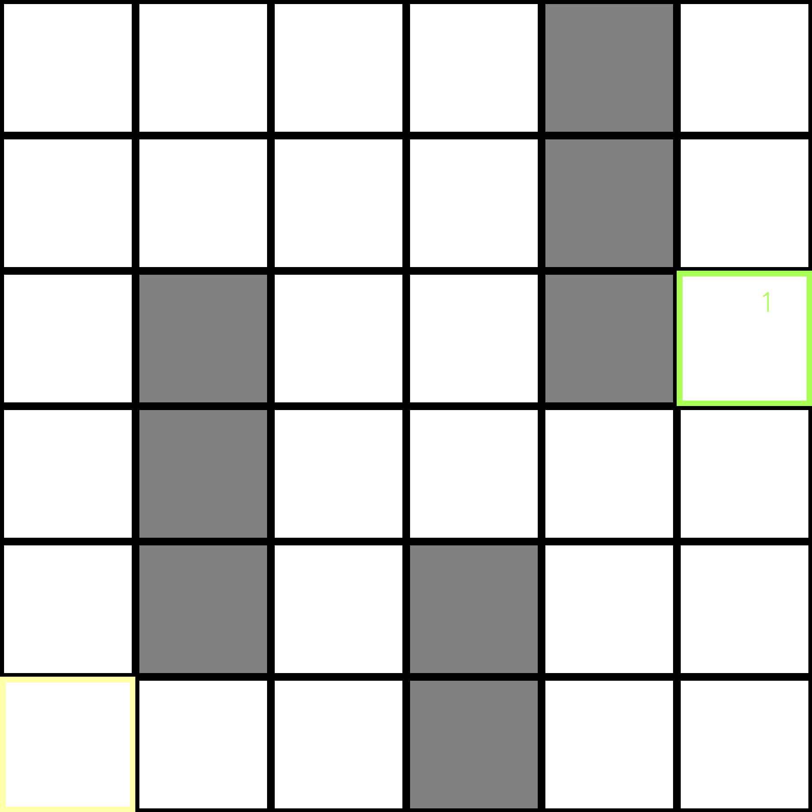
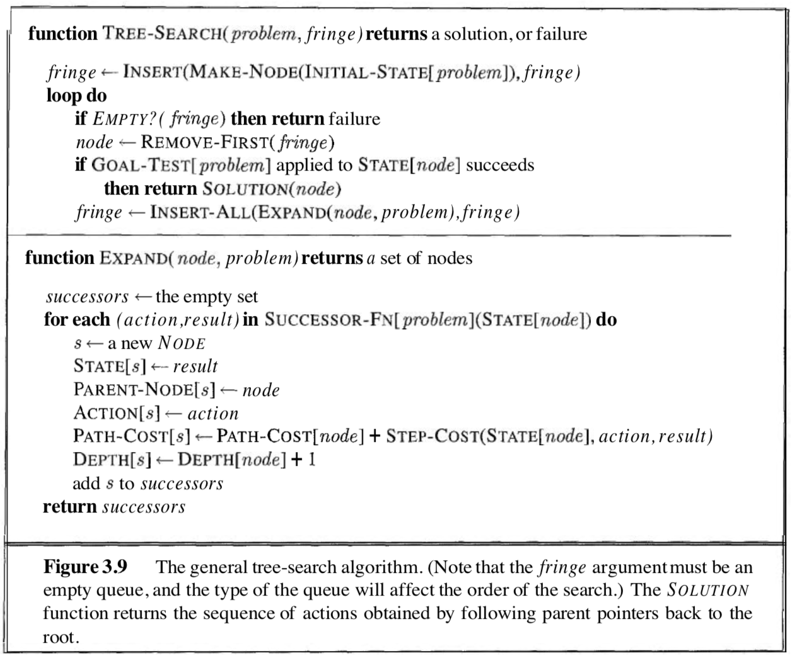
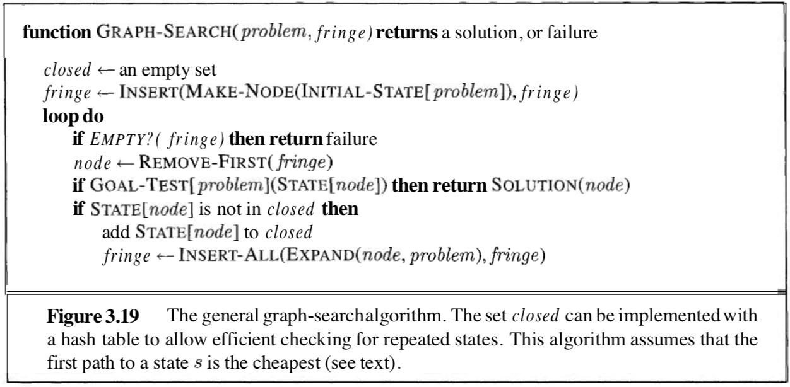
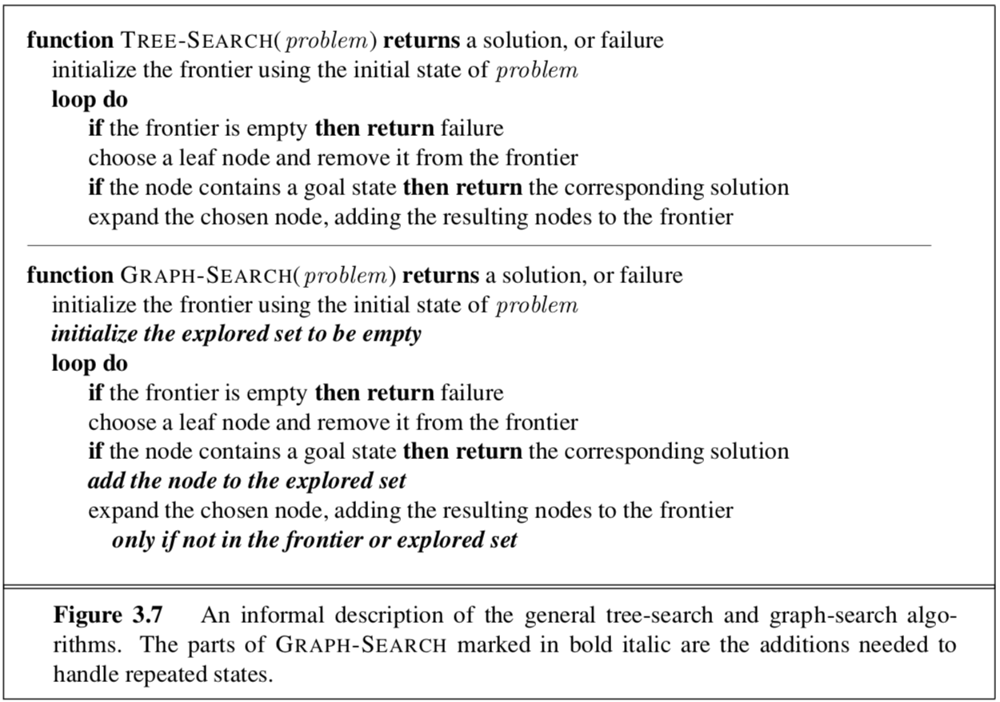

# (Grid) World Playground

**NOTE**: This is a work in progress, searching agents have been implemented and are ready to be used, but planning and learning agents aren't ready yet.

## What's this?

This is a personal project of mine where I aim to implement various AI algorithms in order to solve the Grid World Problem, which are also applicable to other discrete action space problems. 

**The primary purpose of this project is to measure, explain, and cover all-encompassing logic and intuition behind different algorithm families on a standardized test that is the Grid World.**

This is a strange **mix of typical blog post and a GitHub repo**. Each algorithm that is implemented is explained and, when appropriate, visualized for easier understanding of its underlying principles. [Additional reading](#literature) is, however, required. There is a [chapter explaining the code itself](), but one should read the source code to gain a better understanding how the project works. **All classes and functions are thoroughly commented and explained in the code.**

Algorithms that are included are:

* (**IMPLEMENTED**) Traditional uninformed and informed **search methods** (Breadth-First Search, Depth-First Search, Depth-Limited Search, Branch-And-Bound Search, Greedy-Best-First Search, Hill-Climbing Search and A\* Search)
* (**TBI**) **Planning algorithms**: Value iteration, Q-Value iteration, Policy Iteration
* (**TBI**) **Learning algorithms**: Temporal difference methods, Monte Karlo Methods

### Guiding principles

* **Code is as self explanatory as possible.** The main purpose of this project is to explain the implemented algorithms, rather than to be computationally efficient. Although good software engineering practices were followed, some places for computational improvement could probably be found.
* **Core algorithm implementations closely resemble pseudocode found in literature**. [Artificial Intelligence: A Modern Approach, 2nd Edition by Russell & Norvig](https://www.amazon.com/Artificial-Intelligence-Modern-Approach-2nd/dp/0137903952) and [Reinforcement Learning, 2nd Edition by Sutton & Barto](https://web.stanford.edu/class/psych209/Readings/SuttonBartoIPRLBook2ndEd.pdf) were used.
* **All implemented agents (search, planning and learning) are completely decoupled from the world they live in.** This means that one may either implement new agents through subclassing easily, or create new Worlds other than the Grid World used in all exaples. Creation of new worlds is limited, however, to **discrete action space Worlds**.

## Who is this for?

**Anyone who has some Python experience and is relatively new to the field of Artificial Intelligence**. However, as mentioned above, some prior reading is recommended. This project came to being during my master's degree studies in computer science, and is largely influenced by the materiels I studied from either as course requirements, or as personal research. 

I will try to explain the theory behind the algorithms, but I won't be covering each algorithm individually in detail. I believe the literature I have referenced is amazing and will do a much better job at explaining specifics. Instead, I will try to cover an all-encompasing logic and intuition behind these algorithms which I've obtained both reading about them and implementing them.

## Legend

The rest of this page is divided as follows:

* **[Grid World](#grid-world)**: Explains what is Grid World and lists its important characteristics.
* **[Theory](#theory)**: Covers **[Searching Algorithms](#searching-algorithms)**, **[Planning Algorithms](#planning-algorithms)**, and **[Learning Algorithms](#learning-algorithms)**. Gives the obtained results applying these algorithms to different Grid World configurations.
* **[Code](#code)**: Explains core classes and mechanisms. Detailed descriptions of functions and classes are given in the code itself, through comments.
* **[Literature](#literature)**: Provides important and optional resources. 

## Grid World

The Grid World setup we will use throughout the explanatiotns is given below. Yellow-Bounded state represents agent's starting position, while Green-Bounded state represents agent's goal, depicting the reward awaiting agent when it reaches it. Gray blocks represent walls which agents cannot pass through.

Agents have 4 actions available, UP, DOWN, LEFT, and RIGHT. The trick is, these actions are stochastic. If the agent chooses to go in any direction, there is an assigned probability of agent taking the intended action, and probabilities of agent taking random action orthogonal to the intended action. For example, if agent chooses to go UP, we can configure the **transition model** so that agent will actually go up in 80% of the cases, but in 10% of the cases it will go LEFT, and in 10% of the cases it will go RIGHT. Same goes for the rest of the three available actions.

**NOTE**: Through code, one could configure arbitrary Grid World dimensions, walls, start and terminal states. There could be multiple terminal states, with different both positive and negative rewards associated. Furthermore, transition model probabilities are also configurable, including making Grid World deterministic.

The important characteristics of Grid World, by definition are:

* **static**: There are no changes in the environment while agents are solving it.
* **fully observable**: Agents see an entire percept while in certain state. In the case of Grid World, percepts are directly mapped to states and are represented by row and column index of a current field they are in.
* **discrete | discrete action space**: There is a finite, countable, number of actions agent can take in any single state.
* **stochastic**: As a consequence of stochastic transition model, the intended action will not necessarily be the action that is taken.
* **repeated states allowed**: Agent can potentially return to states already visited earlier during his search.

**NOTE**: If you are having difficulties understanding the difference between partial and full observability, like I initially did, imagine a first person shooter game. There are two ways we can go about solving it, in terms of agent's percepts. First approach is to give our agent exact locations of all relevant object in the game, including other players or agents, walls, objectives etc. In that case, each state could be represented by the vector of these, relevant, values. The other option is to give agent only what the player would normally see while playing the game, like in [VizDoom](https://github.com/mwydmuch/ViZDoom), for example. The first approach is a case of a fully observable environment, even though environment may change at any moment due to actions of other players. In other words, environment is non-static, but fully observable. This is because our agent has all necessary information in every state. The second case is an example of a prartially observable environment, because our agent might not have all necessary information affecting its current state (like some other player standind behind him, pointing a gun to his head).

## Theory

**NOTE**: **This is a work in progress**. Only searching algorithms are covered for now, as they are the only ones to be implemented. Planning and learning algorithms will be posted soon. (Within the next month or so)

### Searching algorithms

Right from the start, someone who already knows something about searching algorithms will notice three problems:

* **repeated states**: Searching algorithms are often thaught on problems with no repeated states. That is, agent cannot reach states it has already visited during his search. Russel & Norvig use map of Romania as their leading example, but they do provide a general algorithm frame for searching for solutions where repeated states are allowed, called **Graph-Search**. This is why all of the searching algorithms that are implemented here are based off of GridSearch, and have an additional internal structure for keeping track of which states they had visited.
* **multiple terminal states**: Out of which some may potentially be terrible, with negative rewards associated. As we will see, algorithms that keep track of the path cost and informed algorithms that use a heuristic (depending on how good the heuristic is) may potentially avoid these terrible states.
* **stochastic nature**: Searching agents cannot handle the stochastic nature of this problem, which is why more advanced dynamic programming solutions exist. As Russel & Norvig state, from the point of view of searching agents, solutions to problems are single sequences of actions and agents execute these actions without really paying attention to percepts.

Because of this, Grid World problem is usually introduced when people learn about [Markov Decision Processes](https://en.wikipedia.org/wiki/Markov_decision_process) and [planning agents](#planning-algorithms).

I will provide solutions to three problems, as given by grid_world.py:

* **SIMPLE_GRID_WORLD**: A problem redesigned so searching agents can solve it. Actions are deterministic, and there is only one terminal state.
* **MULTIPLE_DESTINY_GRID_WORLD**: There are multiple terminal states, but transition model is deterministic. Some agents have increased chance of finding good solutions, and some may even find optimal solutions. Some may fail and end up in some terrible terminal state. In other words, destiny.
* **CHAOTIC_GRID_WORLD**: Transition model is stochastic and there are multiple terminal states, that is, a traditional grid world problem. Agents are expected to fail, but it's still fun to see them desperately try not to.

### Graph Search Frame

The three images below depict the core Search algorithm implemented within a **TreeSearch** class (which is actually a Graph Search, lol). This class is then subclassed, providing specific search algorithms.

The first two images come from the second eddition of Russel & Norvig: Artificial Intelligence: A Modern approach, while the third one comes from the third. Personally, I think the first two are much more informative, but the third one is more beginner friendly as it requires no pseudo-code reading.

You will notice that the only difference between a Graph Search and a Tree Search is that Graph Search includes a data structure **closed** which tkat keeps track of the nodes (states, percepts) already visited during the search.

For a good understanding of the algorithm depicted above, one needs to know all of the referenced data structures and functions. I recommend reading the appropriate section of the book, given in [Literature](#literature), as I am only briefly covering these concepts:

* **NODE**: A data structure containing a **state** to which the node corresponds -- a row and column index in case of Grid World and called **percept** within the code; **parent node** -- a pointer to the previous **NODE** structure; **action** -- action taken while at parent node, which resulted in opening current node; **path cost** -- Cummulative path cost of reaching current node, since the beginning of time (from starting state); **depth** -- number of previous nodes, that is, number of actions taken from start state until current node.
* **fringe**: A queue containing yet unexplored **NODEs**. These nodes are leafs in a current search tree that may potentially lead to solution when explored. This queue may be LIFO or FIFO depending on the specific search algorithm. Also called **open** queue, as opposed to **closed** data structure referenced earlier.
* **REMOVE-FIRST**: A logic which removes the next **NODE** to be explored from **fringe**.
* **GOAL-TEST**: Function that tests whether goal is reached, in other words, whether a state is terminal.
* **SOLUTION**: Takes a current **NODE** which represents a terminal state and back tracks parent nodes to list out a path from start state to terminal state.
* **INSERT-ALL**: Again, depends on specific algorithm implementation. Inserts successors to current **NODE** in some fashion.
* **SUCCESSOR-FUNCTION**: Defined by the environment, mapping states to next states, via the taken actions.
* **EXPAND**: Described on the first image, above. Fairly self-explanatory.

In other words, only two functions actually determine the behavior of specific searching agents derived from Graph Search. Function **REMOVE-FIRST** and function **INSERT-ALL**. The implemented code closely follows the pseudocode provided above, where these two functions are mapped to **_select_next_action()**, **_order_expanded_nodes()**, and **_reorder_fringe()** in class TreeSearch (which is actually a Graph Search, double lol).

Each specific algorithm will have three visualizations associated, obtained solving SIMPLE_GRID_WORLD, MULTIPLE_DESTINY_GRID_WORLD, CHAOTIC_GRID_WORLD. These visualizations contain:

* **DEEP PURPLE FIELD**: Final solution obtained by a specific algorithm.
* **LIGHR PURPLE FIELD**: Nodes that were expanded during the search, and whose children were added to the fringe.
* **SALMON PINK FIELD**: Nodes that were added to the fringe at some point, but never explored because solution was found along some other path.
* **WHITE NUMBER**: Expansion order.
* **GREEN OR RED BOUNDED FIELD**: Terminal states.
* **YELLOW BOUNDED FIELD**: Starting state.
* **WIERD ARROWS AND NUMBERS**: Heuristic, will be explained later in detail.

#### Uninformed algorithms

##### Breadth-First Search
##### Depth-First Search
##### Branch-and-Bound Search
#### Informed algorithms
##### Greedy-Best-First Search
##### Hill-Climbing Search
##### A* Search

#### Planning algorithms
#### Learning algorithms
### Code

#### Dependencies

* **Python 3.6**
* **Numpy**: for number crunching
* **OpenCV**: for visualizations, not mandatory but **highly recommended**

Both numpy and opencv can be installed via the pip3 command:
`pip3 install numpy, opencv-python`

#### Core Logic

All logic is implemented within:

* **[ai_agents.py](../ai_agents.py)**: Implements various agents through subclassing abstract AI class. Abstract AI class has just one field, self._world, which holds the World agent lives in.
* **[world.py](../ai_agents.py)**: Implements GridWorld through subclassing of the abstract World class.
* **[visualizations.py](../ai_agents.py)**: Contains abstract WorldVisualizer and subclasses GridVisualizer which is responsible for opencv visualizations depicted in section [Theory](#theory).

Key code features are:

* Code enforces strictly object oriented approach, code replication is non existent.
* Agents are decoupled from the worlds they live in. This means that any implemented agent can work with any world, as long as this new world is derived from the World class.
* Agents are implemented as closely to the pseudo code found in [literature](#literature). Agents can be easily subclassed for more specific behavior.
* Worlds and agents are decoupled from their visualization. If one does not want to use opencv, or wants to implement their own visualization, one needs to change the WorldVisualizer class and not the World itself.

Even though they are decoupled, agents and worlds must communicate in some way. Agents enact actions in the World, and World is responsible for keeping itself in a consistent state. Furthermore, in order to debug agents and create detailed visualizations of their underlying logic, agents must cooperate with Worlds so that those visualizations can be created. **I list below several important constraints which must be respected**:

* **enacting action - information passing**: When asking for a reward, or trying to enact the action, agent must communicate to the World what it wants to do. It passes a **percept** argument and, when required, **action_id** argument. **percept** argument is always a Python tuple containing percepts available at current agent state. **action_id** depends on which actions are available to the agent, based on the world it lives in.
* **visualizing internal states - information passing**: In order to visualize agent's internal states, agents and worlds must act together. Agent holds relevant info about self, which world has nothing about. Similarly, World hodls information about self, which should never be available to the agent. This information passing is via **percept_viz** argument which must be a Python dictionary, containing percepts mapped to PerceptViz objects containing necessary info for visualization. PerceptViz objects are merely containers for necessary data, with all variables public. When creating a new world one can either just add new arguments to PerceptViz class, or just subclass it.

**Finally, code is thoroughly commented and I recommend going streight to code from here.**

### Literature

#### Basics (Searching, Planning, Learning)

All of the listed resources are freely available online, but out of respect for the authors, I am not providing links:

I highly recommend reading through **chapters 1 - 4**, which cover introduction to AI and searching algorithms, and **chapters 17 and 21** which cover planning and learning algorithms, from [Artificial Intelligence: A Modern Approach, 2nd Edition by Russell & Norvig](https://www.amazon.com/Artificial-Intelligence-Modern-Approach-2nd/dp/0137903952). Optionally, one could read **chapters 4 and 5** from [Reinforcement Learning, 2nd Edition by Sutton & Barto](https://web.stanford.edu/class/psych209/Readings/SuttonBartoIPRLBook2ndEd.pdf), which cover the two core learning approaches more in depth.

#### Optional Great Resources