# (Grid) World Playground

**NOTE**: This is a work in progress, searching agents have been implemented and are ready to be used, but planning and learning agents aren't ready yet.

## What's this?

This is a personal project of mine where I aim to implement various AI algorithms in order to solve the Grid World Problem, which are also applicable to other discrete action space problems. 

**The primary purpose of this project is to measure, explain, and cover all-encompassing logic and intuition behind different algorithm families on a standardized test that is the Grid World.**

This is a strange **mix of typical blog post and a GitHub repo**. Each algorithm that is implemented is explained and, when appropriate, visualized for easier understanding of its underlying principles. [Additional reading](#literature) is, however, required. There is a [chapter explaining the code itself](), but one should read the source code to gain a better understanding how the project works. **All classes and functions are thoroughly commented and explained in the code.**

Algorithms that are included are:

* (**IMPLEMENTED**) Traditional uninformed and informed **search methods** (Breadth-First Search, Depth-First Search, Depth-Limited Search, Branch-And-Bound Search, Greedy-Best-First Search, Hill-Climbing Search and A\* Search)
* (**TBI**) **Planning algorithms**: Value iteration, Q-Value iteration, Policy Iteration
* (**TBI**) **Learning algorithms**: Temporal difference methods, Monte Karlo Methods

### Guiding principles

* **Code is as self explanatory as possible.** The main purpose of this project is to explain the implemented algorithms, rather than to be computationally efficient. Although good software engineering practices were followed, some places for computational improvement could probably be found.
* **Core algorithm implementations closely resemble pseudocode found in literature**. [Artificial Intelligence: A Modern Approach, 2nd Edition by Russell & Norvig](https://www.amazon.com/Artificial-Intelligence-Modern-Approach-2nd/dp/0137903952) and [Reinforcement Learning, 2nd Edition by Sutton & Barto](https://web.stanford.edu/class/psych209/Readings/SuttonBartoIPRLBook2ndEd.pdf) were used.
* **All implemented agents (search, planning and learning) are completely decoupled from the world they live in.** This means that one may either implement new agents through subclassing easily, or create new Worlds other than the Grid World used in all exaples. Creation of new worlds is limited, however, to **discrete action space Worlds**.

## Who is this for?

**Anyone who has some Python experience and is relatively new to the field of Artificial Intelligence**. However, as mentioned above, some prior reading is recommended. This project came to being during my master's degree studies in computer science, and is largely influenced by the materiels I studied from either as course requirements, or as personal research. 

I will try to explain the theory behind the algorithms, but I won't be covering each algorithm individually in detail. I believe the literature I have referenced is amazing and will do a much better job at explaining specifics. Instead, I will try to cover an all-encompasing logic and intuition behind these algorithms which I've obtained both reading about them and implementing them.

## Legend

The rest of this page is divided as follows:

* **[Grid World](#grid-world)**: Explains what is Grid World and lists its important characteristics.
* **[Theory](#theory)**: Covers **[Searching Algorithms](#searching-algorithms)**, **[Planning Algorithms](#planning-algorithms)**, and **[Learning Algorithms](#learning-algorithms)**. Gives the obtained results applying these algorithms to different Grid World configurations.
* **[Code](#code)**: Explains core classes and mechanisms. Detailed descriptions of functions and classes are given in the code itself, through comments.
* **[Literature](#literature)**: Provides important and optional resources. 

## Grid World

The Grid World setup we will use throughout the explanatiotns is given below. Yellow-Bounded state represents agent's starting position, while Green-Bounded state represents agent's goal, depicting the reward awaiting agent when it reaches it. Gray blocks represent walls which agents cannot pass through.

Agents have 4 actions available, UP, DOWN, LEFT, and RIGHT. The trick is, these actions are stochastic. If the agent chooses to go in any direction, there is an assigned probability of agent taking the intended action, and probabilities of agent taking random action orthogonal to the intended action. For example, if agent chooses to go UP, we can configure the **transition model** so that agent will actually go up in 80% of the cases, but in 10% of the cases it will go LEFT, and in 10% of the cases it will go RIGHT. Same goes for the rest of the three available actions.

**NOTE**: Through code, one could configure arbitrary Grid World dimensions, walls, start and terminal states. There could be multiple terminal states, with different both positive and negative rewards associated. Furthermore, transition model probabilities are also configurable, including making Grid World deterministic.

The important characteristics of Grid World, by definition are:

* **static**: There are no changes in the environment while agents are solving it.
* **fully observable**: Agents see an entire percept while in certain state. In the case of Grid World, percepts are directly mapped to states and are represented by row and column index of a current field they are in.
* **discrete | discrete action space**: There is a finite, countable, number of actions agent can take in any single state.
* **stochastic**: As a consequence of stochastic transition model, the intended action will not necessarily be the action that is taken.
* **repeated states allowed**: Agent can potentially return to states already visited earlier during his search.

**NOTE**: If you are having difficulties understanding the difference between partial and full observability, like I initially did, imagine a first person shooter game. There are two ways we can go about solving it, in terms of agent's percepts. First approach is to give our agent exact locations of all relevant object in the game, including other players or agents, walls, objectives etc. In that case, each state could be represented by the vector of these, relevant, values. The other option is to give agent only what the player would normally see while playing the game, like in [VizDoom](https://github.com/mwydmuch/ViZDoom), for example. The first approach is a case of a fully observable environment, even though environment may change at any moment due to actions of other players. In other words, environment is non-static, but fully observable. This is because our agent has all necessary information in every state. The second case is an example of a prartially observable environment, because our agent might not have all necessary information affecting its current state (like some other player standind behind him, pointing a gun to his head).

## Theory

**NOTE**: **This is a work in progress**. Only searching algorithms are covered for now, as they are the only ones to be implemented. Planning and learning algorithms will be posted soon. (Within the next month or so)

### Searching algorithms

Right from the start, someone who already knows something about searching algorithms will notice three problems:

* **repeated states**: Searching algorithms are often thaught on problems with no repeated states. That is, agent cannot reach states it has already visited during his search. Russel & Norvig use map of Romania as their leading example, but they do provide a general algorithm frame for searching for solutions where repeated states are allowed, called **Graph-Search**. This is why all of the searching algorithms that are implemented here are based off of GridSearch, and have an additional internal structure for keeping track of which states they had visited.
* **multiple terminal states**: Out of which some may potentially be terrible, with negative rewards associated. As we will see, algorithms that keep track of the path cost and informed algorithms that use a heuristic (depending on how good the heuristic is) may potentially avoid these terrible states.
* **stochastic nature**: Searching agents cannot handle the stochastic nature of this problem, which is why more advanced dynamic programming solutions exist. As Russel & Norvig state, from the point of view of searching agents, solutions to problems are single sequences of actions and agents execute these actions without really paying attention to percepts.

Because of this, Grid World problem is usually introduced when people learn about [Markov Decision Processes](https://en.wikipedia.org/wiki/Markov_decision_process) and [planning agents](#planning-algorithms).

I will provide solutions to three problems, as given by grid_world.py:

* **SIMPLE_GRID_WORLD**: A problem redesigned so searching agents can solve it. Actions are deterministic, and there is only one terminal state.
* **MULTIPLE_DESTINY_GRID_WORLD**: There are multiple terminal states, but transition model is deterministic. Some agents have increased chance of finding good solutions, and some may even find optimal solutions. Some may fail and end up in some terrible terminal state. In other words, destiny.
* **CHAOTIC_GRID_WORLD**: Transition model is stochastic and there are multiple terminal states, that is, a traditional grid world problem. Agents are expected to fail, but it's still fun to see them desperately try not to.

### Graph Search Frame

The three images below depict the core Search algorithm implemented within a **TreeSearch** class (which is actually a Graph Search, lol). This class is then subclassed, providing specific search algorithms.

The first two images come from the second eddition of Russel & Norvig: Artificial Intelligence: A Modern approach, while the third one comes from the third. Personally, I think the first two are much more informative, but the third one is more beginner friendly as it requires no pseudo-code reading.

You will notice that the only difference between a Graph Search and a Tree Search is that Graph Search includes a data structure **closed** which tkat keeps track of the nodes (states, percepts) already visited during the search.

  

For a good understanding of the algorithm depicted above, one needs to know all of the referenced data structures and functions. I recommend reading the appropriate section of the book, given in [Literature](#literature), as I am only briefly covering these concepts:

* **NODE**: A data structure containing a **state** to which the node corresponds -- a row and column index in case of Grid World and called **percept** within the code; **parent node** -- a pointer to the previous **NODE** structure; **action** -- action taken while at parent node, which resulted in opening current node; **path cost** -- Cummulative path cost of reaching current node, since the beginning of time (from starting state); **depth** -- number of previous nodes, that is, number of actions taken from start state until current node.
* **fringe**: A queue containing yet unexplored **NODEs**. These nodes are leafs in a current search tree that may potentially lead to solution when explored. This queue may be LIFO or FIFO depending on the specific search algorithm. Also called **open** queue, as opposed to **closed** data structure referenced earlier.
* **REMOVE-FIRST**: A logic which removes the next **NODE** to be explored from **fringe**.
* **GOAL-TEST**: Function that tests whether goal is reached, in other words, whether a state is terminal.
* **SOLUTION**: Takes a current **NODE** which represents a terminal state and back tracks parent nodes to list out a path from start state to terminal state.
* **INSERT-ALL**: Again, depends on specific algorithm implementation. Inserts successors to current **NODE** in some fashion.
* **SUCCESSOR-FUNCTION**: Defined by the environment, mapping states to next states, via the taken actions.
* **EXPAND**: Described on the first image, above. Fairly self-explanatory.

In other words, only two functions actually determine the behavior of specific searching agents derived from Graph Search. Function **REMOVE-FIRST** and function **INSERT-ALL**. The implemented code closely follows the pseudocode provided above, where these two functions are mapped to **_select_next_action()**, **_order_expanded_nodes()**, and **_reorder_fringe()** in class TreeSearch (which is actually a Graph Search, double lol).

Each specific algorithm will have three visualizations associated, obtained solving SIMPLE_GRID_WORLD, MULTIPLE_DESTINY_GRID_WORLD, CHAOTIC_GRID_WORLD. These visualizations contain:

* **DEEP PURPLE FIELD**: Final solution obtained by a specific algorithm.
* **LIGHR PURPLE FIELD**: Nodes that were expanded during the search, and whose children were added to the fringe.
* **SALMON PINK FIELD**: Nodes that were added to the fringe at some point, but never explored because solution was found along some other path.
* **WHITE NUMBER**: Expansion order.
* **GREEN OR RED BOUNDED FIELD**: Terminal states.
* **YELLOW BOUNDED FIELD**: Starting state.
* **WIERD ARROWS AND NUMBERS**: Heuristic, will be explained later in detail.

#### Uninformed algorithms

Uninformed algorithms do not have a heuristic to consult, hence their name. A heuristic is nothing more providing the algorithm with the specific knowledge about the problem, which aims to keep it on the right track. If our agents were tasked to go from some origin city to some some destination city, with path potentially branching and passing through nearby towns and cities, a reasonable heuristic for each city would be its air distance to the destination.

Technically, a heuristic has couple of characteristics that are really important, and not everything can be a heuristic. More on heuristics will be explained later, when I talk informed search algorithms. For now, think of a heuristic as a mean of helping our agent by inputting human intuition, which uninformed algorithms do not have access to.

As I have previously stated, the entire diferrence between all of the searching algorithms is handled within the implementation of **REMOVE-FIRST** and **INSERT-ALL** functions. I list below what these functions are doing for each of the mentioned algorithms.

##### Breadth-First Search

Breadth-First is also called **Blind-Search**, and in a special case, **Uniform-Search**. This special case entails that all path costs must be equal, and in that case guarantees **optimality** of the solution. Optimal solutions are defined as shortest paths from start state to goal state.

Breadth-First is also **complete**, meaning that it will always find a solution if there is one.

**Breadth-First works as a FIFO queue. Nodes that are added to the queue first, are expanded first.** This means that **REMOVE-FIRST** will remove the node that has been in the fringe the longest, while **INSERT-ALL** will add newly expanded nodes to the end of the queue (if we say that we remove nodes from the start of the queue).

As you can see, in the SIMPLE_GRID_WORLD problem, Breadth-First does find an optimal solution. This isn't really a surprise, since here all paths are equal which means that we actually perform Uniform-Cost search. 

In case of MULTIPLE_DESTINY_WORLD problem, Breadth-First fails, reaching the bad outcome. This is because it does not keep track of the total path cost, and, in turn, does not prioritize opening nodes with lower cost.

<a href="./results/search_algorithms/1_SIMPLE/Breadth-First.png">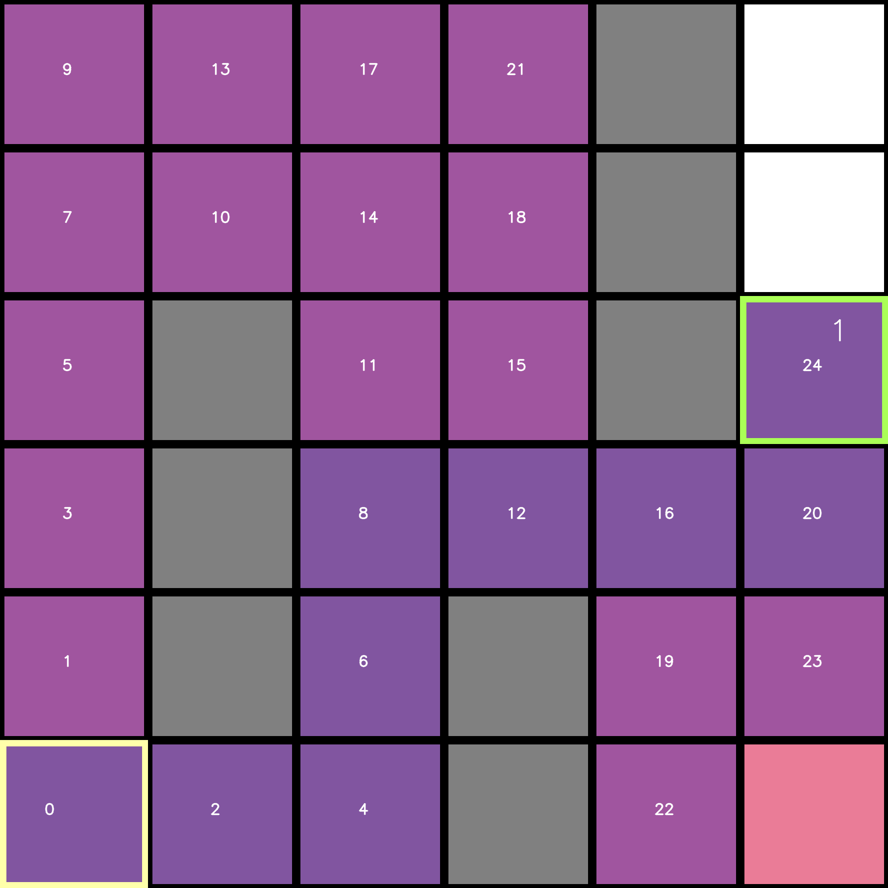</a> <a href="./results/search_algorithms/2_DESTINY/Breadth-First.png">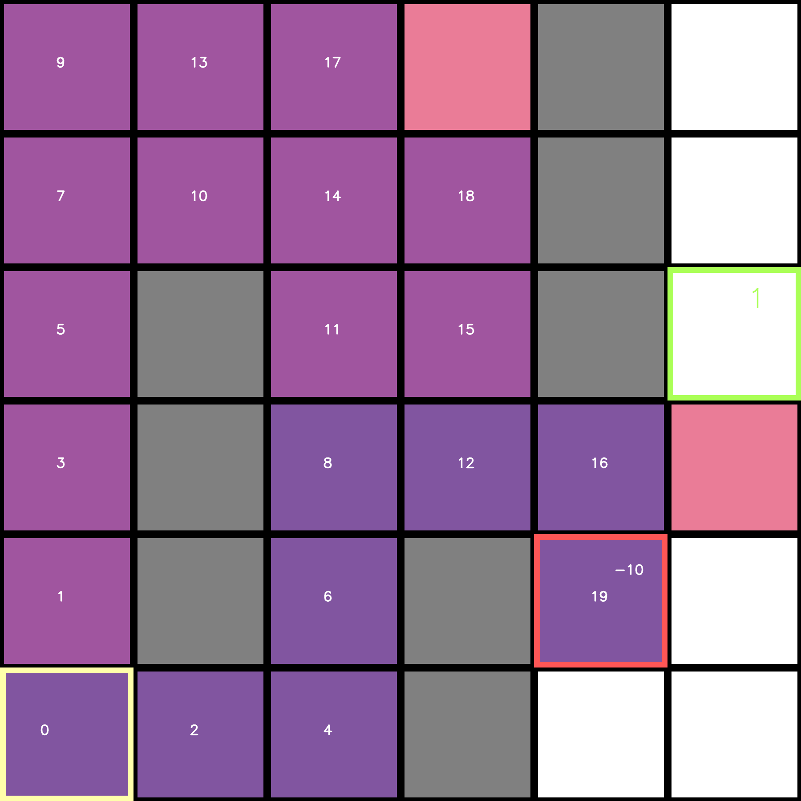</a>

 **SIMPLE_GRID_WORLD** problem visualization on the **left**, visualization of the **MULTIPLE_DESTINY_GRID_WORLD_PROBLEM** on the **right**.
 For visualizations of failed solutions to **CHAOTIC_GRID_WORLD_PROBLEM**, see [uploaded files](experimentation/search_algorithms/3_CHAOTIC).

##### Depth-First Search

**Depth-First works as a LIFO queue. Nodes that are added to the queue last, are expanded first.** This means that **REMOVE-FIRST** will remove the node that has been in the fringe the shortest, while **INSERT-ALL** will add newly expanded nodes to the start of the queue (if we say that we remove nodes from the start of the queue).

**Depth search is neither optimal nor complete**. As shown on the images below, depth first prioritizes one course of action until it either gets stuck, or finds a solution. In case of SIMPLE_GRID_WORLD it found a good solution, but its path was far from optimal. The fact that it is non-complete is more difficult to explain given GridWorld problem as it is complete when applied here. 

**Non-completeness**: Imagine having a binary search tree. From root node to the right lies the solution, but on the left lies an infinitely branching sub-tree. If Depth-First choses to go right, it will instantly find the goal node, however, if it decides to go left it will get stuck in an infinte loop exploring the left sub-tree. This could not happen to Breadth-First Search as it would first explore all the previously expanded nodes before moving on to exploring new expansions.
<a href="./results/search_algorithms/1_SIMPLE/Depth-First.png">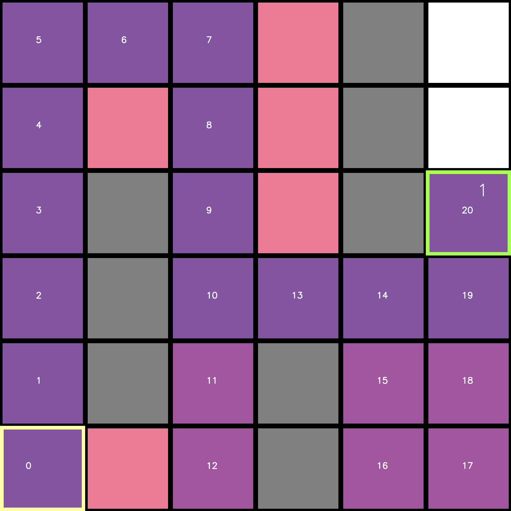</a> <a href="./results/search_algorithms/2_DESTINY/Depth-First.png">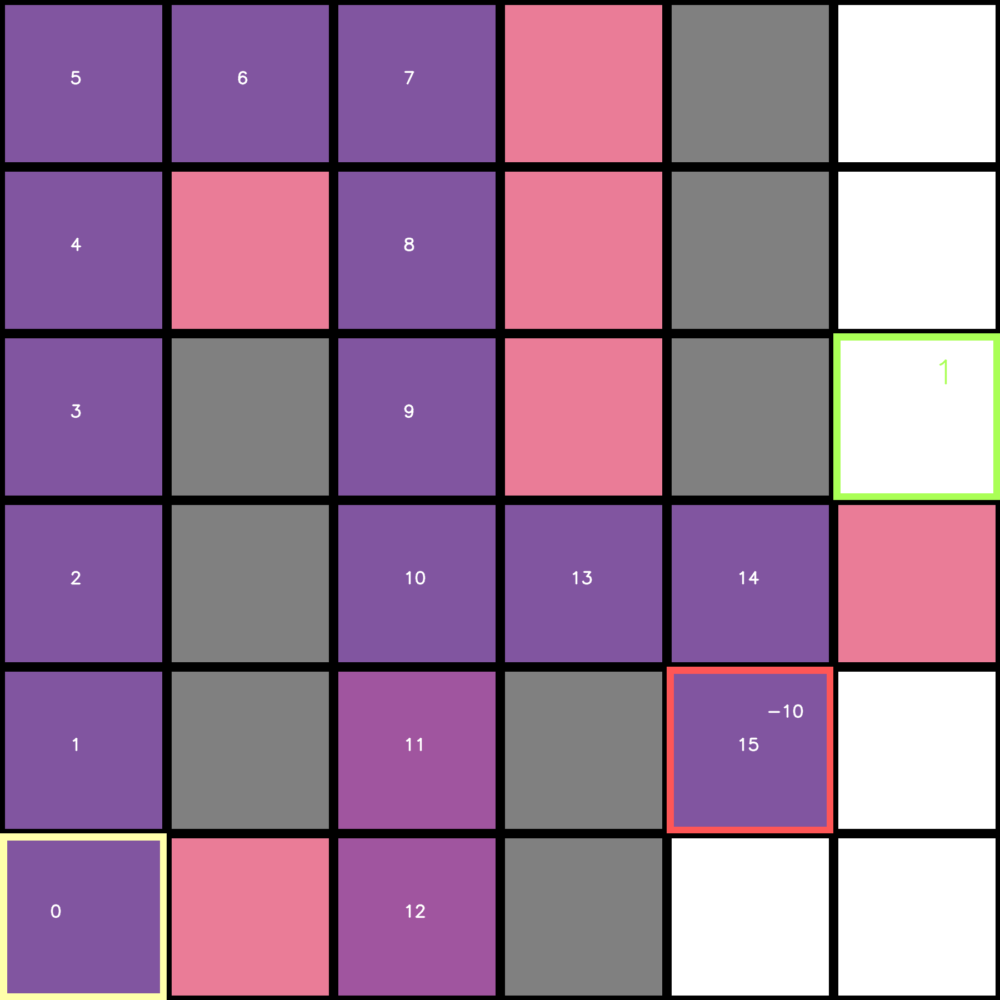</a>
**SIMPLE_GRID_WORLD** problem visualization on the **left**, visualization of the **MULTIPLE_DESTINY_GRID_WORLD_PROBLEM** on the **right**.
 For visualizations of failed solutions to **CHAOTIC_GRID_WORLD_PROBLEM**, see [uploaded files](experimentation/search_algorithms/3_CHAOTIC).

###### Depth-Limited & Iterative-Deepening Search

**Depth-Limited Search** is a mixture of Depth-First and Breadth-First approach. It entails setting a hard limit as to how long the sequence of nodes in a path may be, and stops exploring paths once they get too long. As a result, it explores space much more than classical Depth-First, but may run into a problem if the set limit is not enough to reach the goal node.

As Depth-First Search, it is neither optimal nor complete.

Finally, in **Iterative-Deepening Search** we apply Depth-First logic multiple times, iteratively increasing the maximum depth limit. It starts as Breadth-First if limit is initially set to 1, and then progressively resembles Depth-First search more and more.

Neither of these algorithms are particularly interesting in terms of adding some new intuition to the visualizations, so there are none. Depth-Limited Search, however, is implemented within the code, while Iterative-Deepening Search is not.

##### Branch-and-Bound Search

**[Branch-And-Bound](https://en.wikipedia.org/wiki/Branch_and_bound) cares about path cost.** Please note couple of things:

* Branch-And-Bound may use heuristic function to set **B**, the best solution found so far. Since I've implemented Branch-And-Bound as part of uninformed algorithms, it does not use a heuristic function.
* Branch-And-Bound discards certain nodes if their path costs are greater than the found bound *B**.
* Underlying implementation of Branch-And-Bound can either be Breadth-First, Depth-First, or Best-First (Best-First always keeps fringe ordered so that the next expanded path will have the lowest cost).

In the code, I do not use **B** since I do not use heuristic function, and I use Best-Frist underlying implementation which means that we are going to expand nodes with lowest path cost first anyway. However, in case of MULTIPLE_DESTINY_GRID_WORLD, implementing and checking bound **B** would be very useful if we change underlying implementation of Branch-And-Bound to search for all solutions. If we search for all solutions, we will explore much more states and having **B** would allow us to prune certain paths if they have cummulative path costs greater than solutions already found.

As you can see in the images below, Branch-And-Bound founds optimal solution in both cases, and was saved from making the wrong decision in MULTIPLE_DESTINY_GRID_WORLD by keeping track of path cost.

<a href="./results/search_algorithms/1_SIMPLE/Branch-And-Bound.png">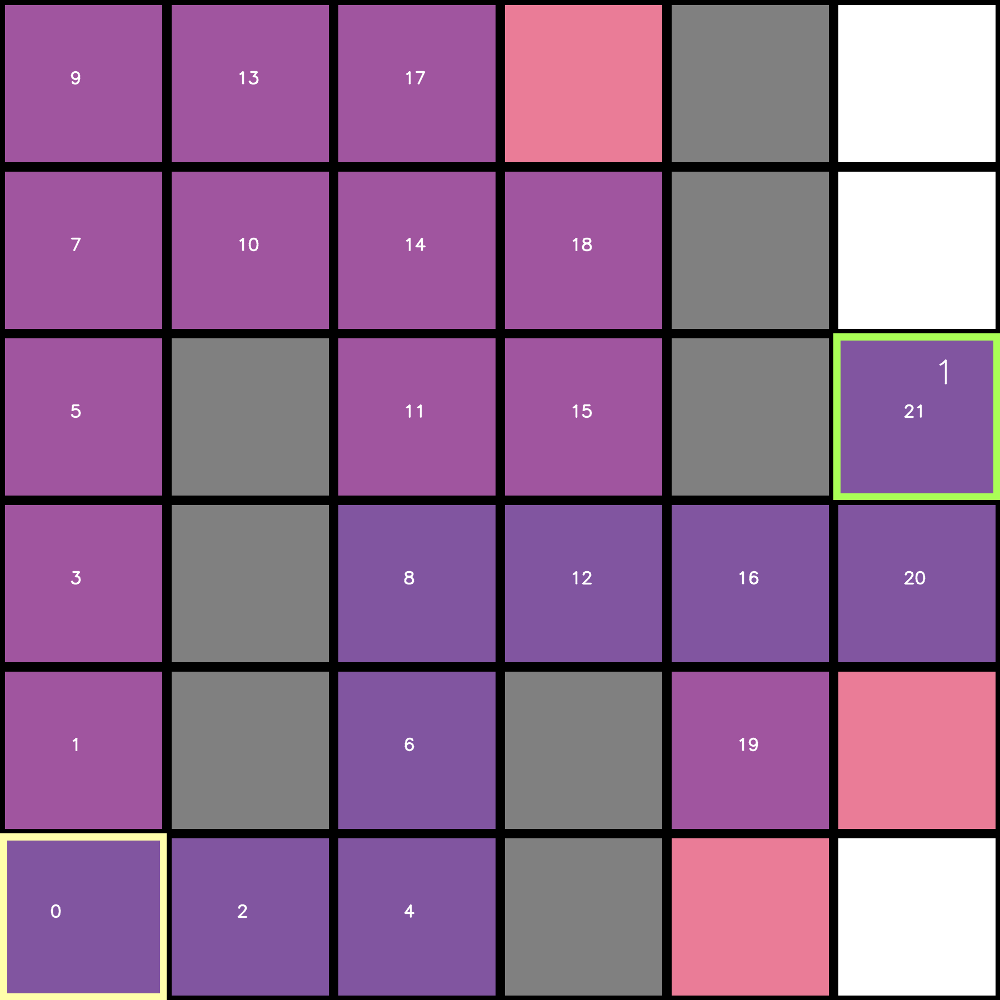</a> <a href="./results/search_algorithms/2_DESTINY/Branch-And-Bound.png">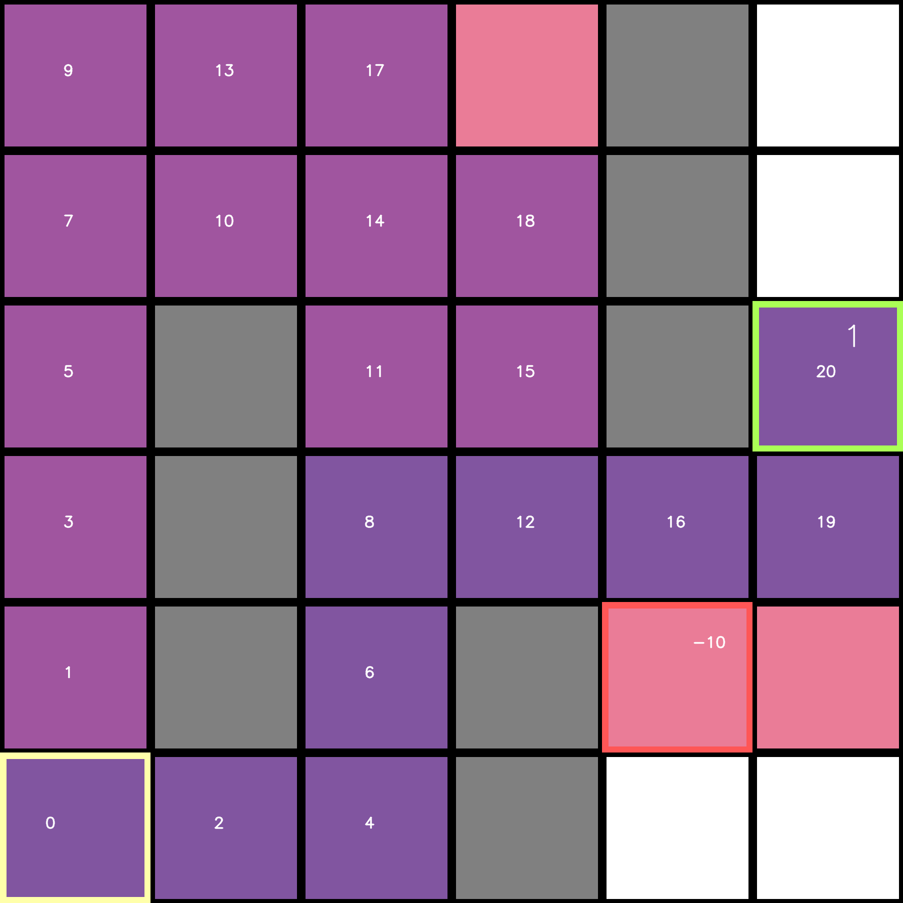</a>
**SIMPLE_GRID_WORLD** problem visualization on the **left**, visualization of the **MULTIPLE_DESTINY_GRID_WORLD_PROBLEM** on the **right**.
 For visualizations of failed solutions to **CHAOTIC_GRID_WORLD_PROBLEM**, see [uploaded files](experimentation/search_algorithms/3_CHAOTIC).

#### Informed algorithms
##### Heuristic

Heuristic, **h(n)** is a function we provide our algorithm which approximates distance (cheapest path) from any node to the goal node. h(n) for the goal node must be 0. There are two important characteristics of a good heuristic:

* **admissability**: h(n) must never overestimate the cost to reach the goal. It can underestimate it, meaning that heuristics are by nature optimistic.
* **consistency**: For every node **n**, and for every successor node of n, **n'**, the estimated cost of reaching the goal from n is no greater than estimated step cost of reaching n' from n, and reaching goal node from n'.
* Every consistent heuristic is also admissable!

Admissability as a criterion is required for a guaranteed optimality of A* algorithm, while consistency is required if we want an elegant implementation of A* graph search. More on that later.

##### Heuristics in our case

###### SIMPLE_GRID_WORLD

For SIMPLE_GRID_WORLD problem, on the left, heuristic is simply the number of nodes to traverse until the goal state is reached, disregarding the walls and applying optimal action at each world state. Obviously, if we do not apply optimal action at each step, the number of nodes will increase, but we are not worried about that.

Looking at starting state, heuristic for actiom RIGHT is 8.0, because we need to traverse 5 nodes to the RIGHT, and 3 nodes UP. If you look at node directly to the RIGHT from starting node, you will see that the cost of going RIGHT will decrease by one.

Hitting a wall means we are staying in the same state, and the associated cost increased by 2 (performing the action, and staying in the same position afterwards).

* This heuristic is **admissable**, as it never underestimates the cost to reach the goal node.
* This heuristic is **not consistent**, as it diregards walls and penalizes wall hitting which leads to some interesting consequences. Look at position (1, 3) and (2, 3) for action DOWN.

###### MULTIPLE_DESTINY_GRID_WORLD

In this configuration we have multiple terminal states, one of which is really bad. This terminal state cannot be simply disregarded by the heuristic as agent might accidentally stumble into it while exploring state space, expecting it to just be a regular state. Furthermore, we cannot assign heuristic value of 0 to a bad terminal state, as agent might potentially chose to follow that state instead of the good one. 

What I did here was take a maximum optimistic path length estimation in this 6x6 GridWorld, which is 12, and inverted heuristic for reaching a bad terminal state to be increasing instead of decreasing. The final heuristic values are obtained using a minimum operator between the values of heuristic for reaching the good terminal state, and the values of heuristic for reaching the bad one.

* Because I used min operator instead of average, this heuristic is **admissable** from the standpoint of a good terminal state. From the standpoint of a bad terminal state it absolutely is not, but that was the point anyway.
* Its definitely **not consistent**.

<a href="./results/search_algorithms/1_SIMPLE/Grid-World.png">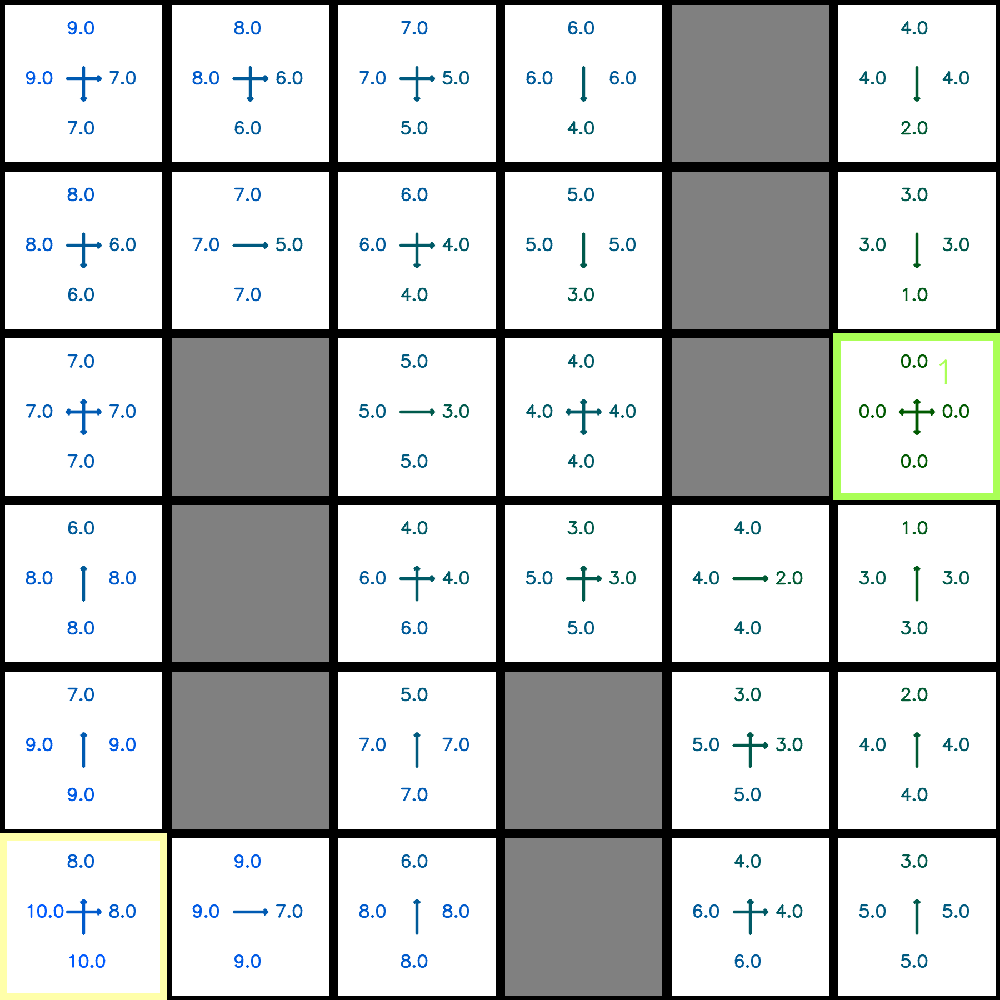</a> <a href="./results/search_algorithms/2_DESTINY/Grid-World.png">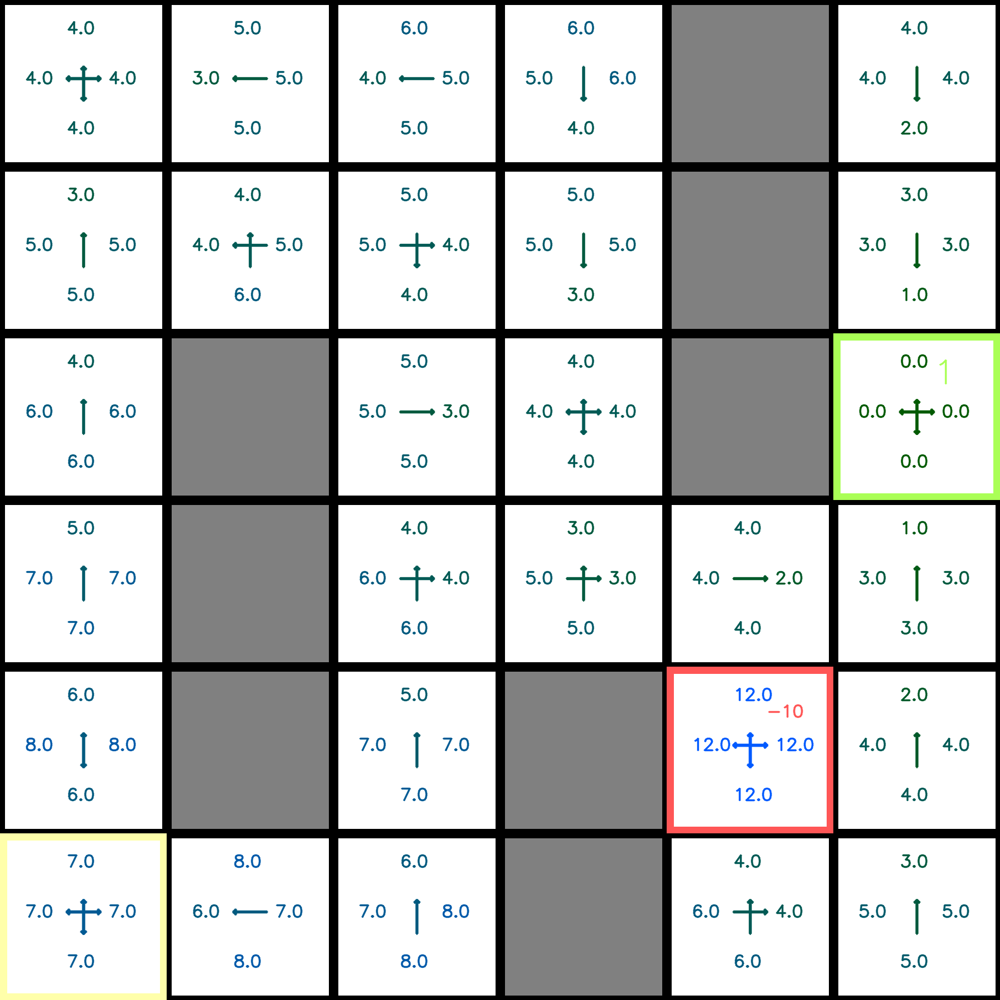</a>
SIMPLE_GRID_WORLD on the left, MULTIPLE_DESTINY_GRID_WORLD on the right. Arrows point in direction with the lowest value of heuristic function, indicating optimal direction for agent to move in. Position counting goes from top left corner, rows and columns indexing starts at 0.

##### Greedy-Best-First Search

**Greedy-Best-First Search just follows the heuristic function values, disregarding path costs**. As such its solution is only good as the used heuristic. Its solution is **not optimal** in general case. This means that fringe is kept in such an order that node with lowest heuristic function value is always expanded first.

In SIMPLE_GRID_WORLD case it has managed to find the optimal solution, while in MULTIPLE_DESTINY_GRID_WORLD, due to shenanigans of the heuristic, it could not. It managed, however, not to end up in the terrible terminal node.

 <a href="./results/search_algorithms/1_SIMPLE/Greedy-Best-First.png">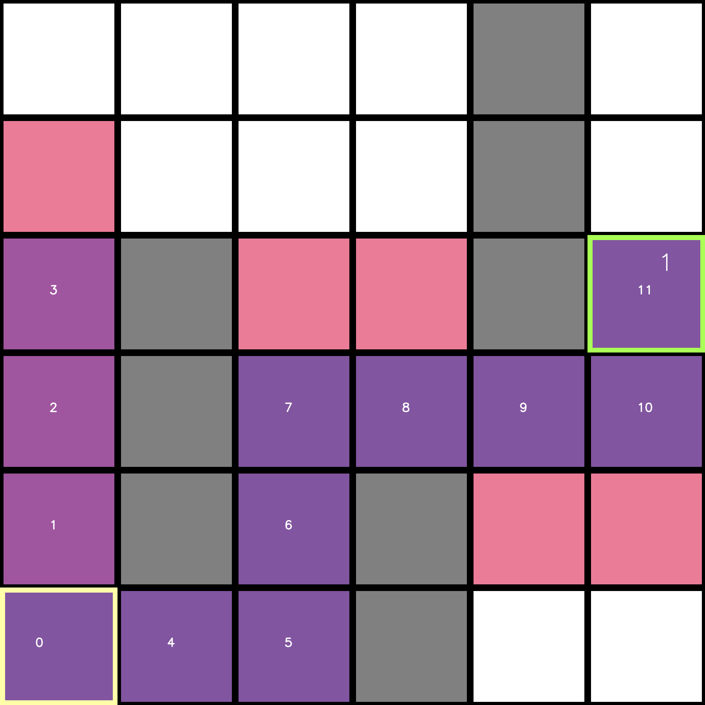</a>
SIMPLE_GRID_WORLD

 <a href="./results/search_algorithms/2_DESTINY/Greedy-Best-First.png">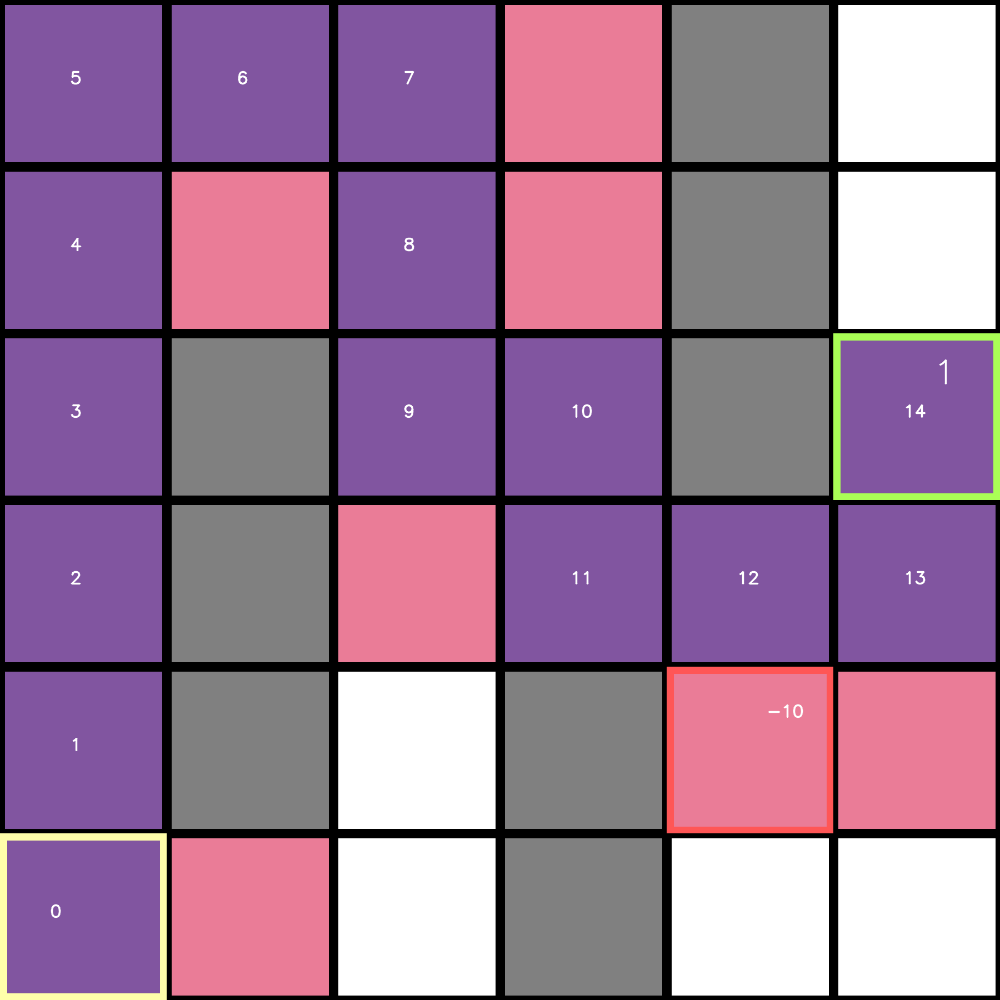</a>
MULTIPLE_DESTINY_GRID_WORLD

##### Hill-Climbing Search

**Hill-Climbing Search** also does not look at path costs, but it does not follow the heuristic blindly. **INSERT-ALL** sorts the **newly expanded** nodes in decreasing heuristic values, so that when they are inserted in the fringe the node with lowest value will be expanded first. It adds these nodes to the beginning of the fringe, so they are expanded earlier than nodes that were previously in the fringe, resembling LIFO queue.

Similarly to Greedy-Best-First search, it is **not optimal**.

In SIMPLE_GRID_WORLD case it has managed to find the optimal solution, while in MULTIPLE_DESTINY_GRID_WORLD, due to shenanigans of the heuristic, it could not. It managed, however, not to end up in the terrible terminal node.

 <a href="./results/search_algorithms/1_SIMPLE/Hill-Climbing.png">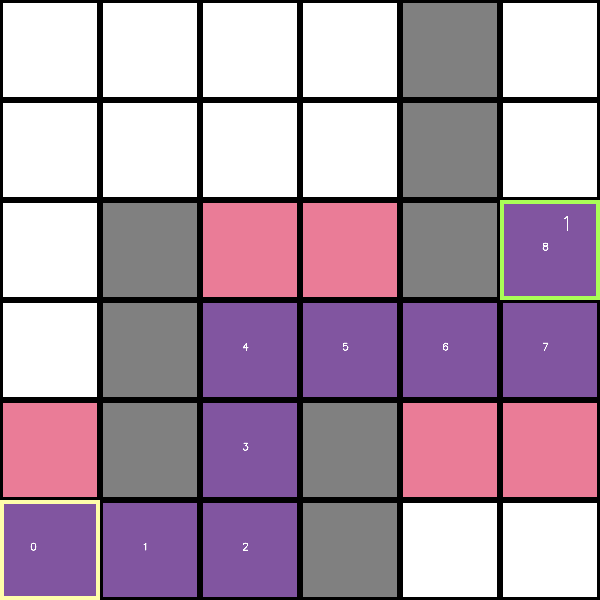</a>
SIMPLE_GRID_WORLD

 <a href="./results/search_algorithms/2_DESTINY/Hill-Climbing.png">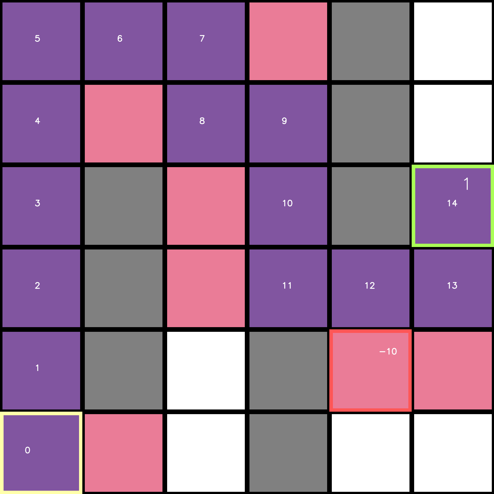</a>
MULTIPLE_DESTINY_GRID_WORLD
##### A* Search

**A\* search combines path cost and heuristic function to form f(n), a function it tries to minimize in order to reach optimal solution.** It is **optimal**, provided that heuristic is **admissable**.

It keeps the fringe ordered by decreasing values of f(n), so that **REMOVE-FIRST** will always remove the node with the lowest value of f(n), obtained as f(n) = g(n) + h(n), where g(n) is the cummulative path cost at node n.

Finally, why do we need **consistent** heuristics? In case of GraphSearch frame, which we utilize here, we keep track of a **closed list**, nodes we have already visited and do not want to visit again. Imagine a scenario in which we open a node that is already in the closed list, which would mean that we have already found some other path to the node we have just expanded. How do we know which path to this node is better, the newly found one or the previous one? **In case of **consistent** heuristics the previous path will always be better!** If heuristic is not consistent, we will need to manually check whether the new path is better than the old one, and potentially replace the node in the closed list.

If our heuristics were consistent, we would never need to check whether some new path is better than the path we have in the closed list. Unfortunatelly for us, I couldnt find such heuristic.

In both SIMPLE_GRID_WORLD and MULTIPLE_DESTINY_GRID_WORLD problems A* manages to find the optimal solution.

 <a href="./results/search_algorithms/1_SIMPLE/A*.png">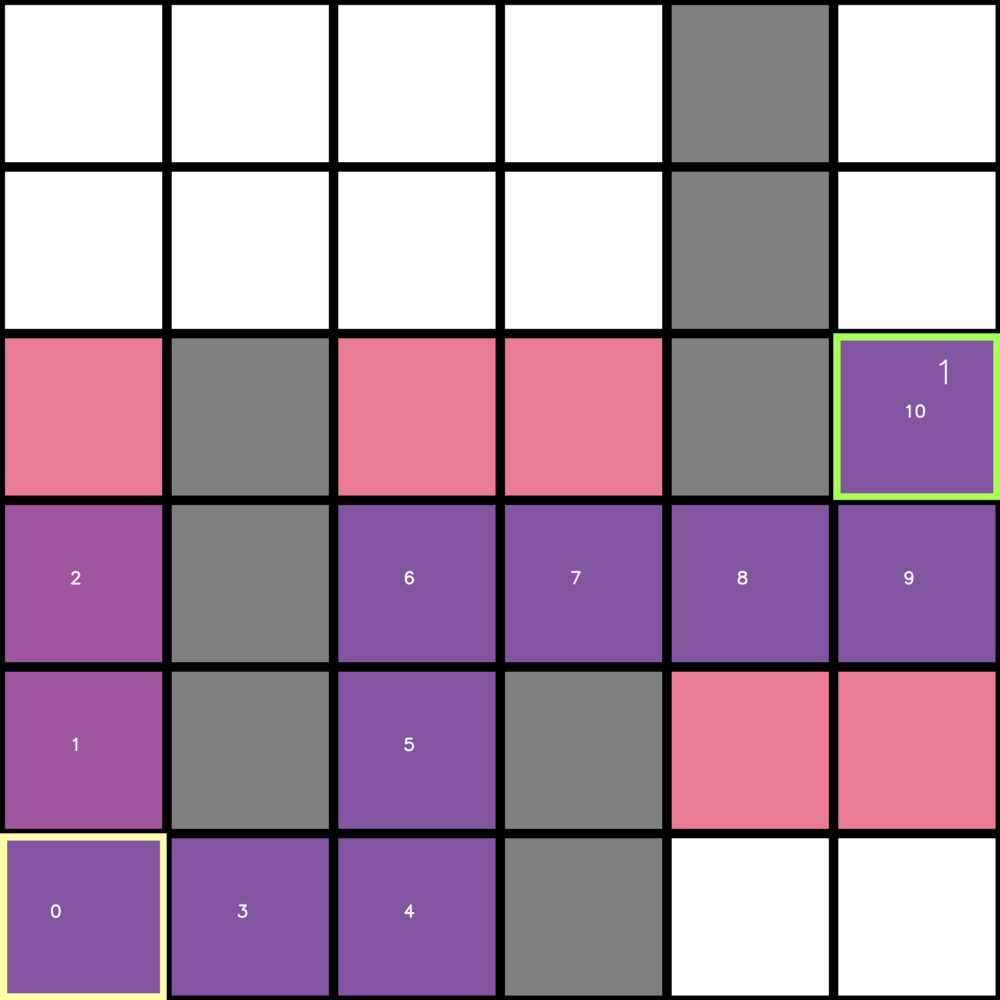</a>
SIMPLE_GRID_WORLD

 <a href="./results/search_algorithms/2_DESTINY/A*.png">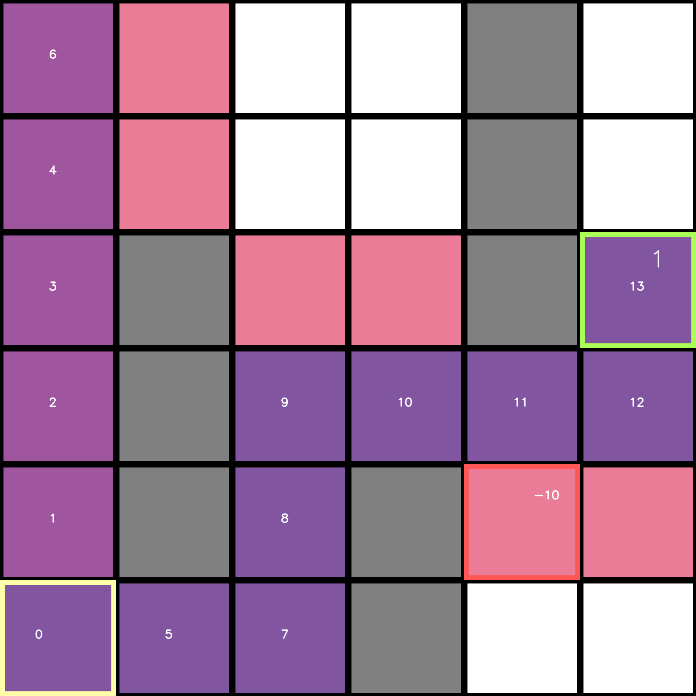</a>
MULTIPLE_DESTINY_GRID_WORLD

#### Final Notes

**If we care only about path cost, why do we need a heuristic?** After all, we found that Branch-And-Bound search performed optimally, using just the cummulative path cost? While it is true that we can obtain optimal solution looking at just the path costs, having a heuristic gives us ability to explore state space much less. This results in obtaining solutions much faster. Compare the visualizations for Branch-And-Bound approach and A* approach.

**Why not always use A\*?** Heuristic might not be available. Also, see below.

**What are the other trade-offs between these algorithms?** Space and time complexity, which directly translates to memory requirements and execution time. You will find detailed analysis of space and time requierments, in terms of branching factor **b**, **d** depth of shallowest goal node, and **m** maximum path of any path in state space, in [Artificial Intelligence: A Modern Approach, 2nd Edition by Russell & Norvig](https://www.amazon.com/Artificial-Intelligence-Modern-Approach-2nd/dp/0137903952).

#### Planning algorithms
#### Learning algorithms
### Code

#### Dependencies

* **Python 3.6**
* **Numpy**: for number crunching
* **OpenCV**: for visualizations, not mandatory but **highly recommended**

Both numpy and opencv can be installed via the pip3 command:
`pip3 install numpy, opencv-python`

#### Core Logic

All logic is implemented within:

* **[ai_agents.py](../ai_agents.py)**: Implements various agents through subclassing abstract AI class. Abstract AI class has just one field, self._world, which holds the World agent lives in.
* **[world.py](../ai_agents.py)**: Implements GridWorld through subclassing of the abstract World class.
* **[visualizations.py](../ai_agents.py)**: Contains abstract WorldVisualizer and subclasses GridVisualizer which is responsible for opencv visualizations depicted in section [Theory](#theory).

Key code features are:

* Code enforces strictly object oriented approach, code replication is non existent.
* Agents are decoupled from the worlds they live in. This means that any implemented agent can work with any world, as long as this new world is derived from the World class.
* Agents are implemented as closely to the pseudo code found in [literature](#literature). Agents can be easily subclassed for more specific behavior.
* Worlds and agents are decoupled from their visualization. If one does not want to use opencv, or wants to implement their own visualization, one needs to change the WorldVisualizer class and not the World itself.

Even though they are decoupled, agents and worlds must communicate in some way. Agents enact actions in the World, and World is responsible for keeping itself in a consistent state. Furthermore, in order to debug agents and create detailed visualizations of their underlying logic, agents must cooperate with Worlds so that those visualizations can be created. **I list below several important constraints which must be respected**:

* **enacting action - information passing**: When asking for a reward, or trying to enact the action, agent must communicate to the World what it wants to do. It passes a **percept** argument and, when required, **action_id** argument. **percept** argument is always a Python tuple containing percepts available at current agent state. **action_id** depends on which actions are available to the agent, based on the world it lives in.
* **visualizing internal states - information passing**: In order to visualize agent's internal states, agents and worlds must act together. Agent holds relevant info about self, which world has nothing about. Similarly, World hodls information about self, which should never be available to the agent. This information passing is via **percept_viz** argument which must be a Python dictionary, containing percepts mapped to PerceptViz objects containing necessary info for visualization. PerceptViz objects are merely containers for necessary data, with all variables public. When creating a new world one can either just add new arguments to PerceptViz class, or just subclass it.

**Finally, code is thoroughly commented and I recommend going streight to code from here.**

### Literature

#### Basics (Searching, Planning, Learning)

All of the listed resources are freely available online, but out of respect for the authors, I am not providing links:

I highly recommend reading through **chapters 1 - 4**, which cover introduction to AI and searching algorithms, and **chapters 17 and 21** which cover planning and learning algorithms, from [Artificial Intelligence: A Modern Approach, 2nd Edition by Russell & Norvig](https://www.amazon.com/Artificial-Intelligence-Modern-Approach-2nd/dp/0137903952). Optionally, one could read **chapters 4 and 5** from [Reinforcement Learning, 2nd Edition by Sutton & Barto](https://web.stanford.edu/class/psych209/Readings/SuttonBartoIPRLBook2ndEd.pdf), which cover the two core learning approaches more in depth.

#### Optional Great Resources